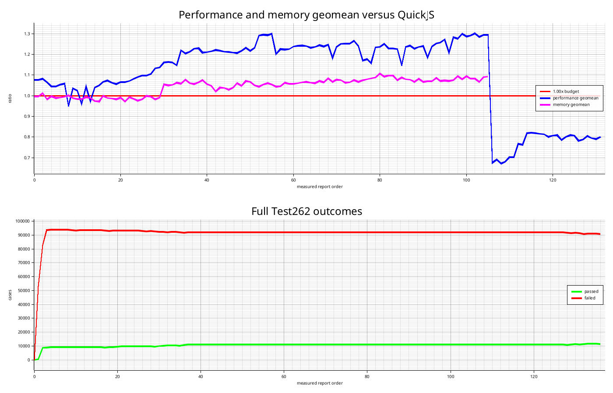

# rs-quickjs

`rs-quickjs` is a safe-Rust JavaScript engine prototype. The long-term goal is to keep the parts that make `QuickJS` attractive for embedded Linux devices, while replacing the native C engine with code that can be audited and evolved as Rust.

This repository is intentionally starting small. It is not a drop-in replacement for `QuickJS` or `rquickjs` yet.

## Current Status



## Goals

- Safe Rust core: no `unsafe` blocks in the engine crate.
- Small footprint: keep startup and hello-world memory use close to the `QuickJS` class of engines.
- Predictable library embedding: make the Rust API the primary product surface, with many isolated virtual machines per process, explicit resource limits, deterministic teardown, typed host extensions, async host-callback support, and inspectable execution state.
- Reference-driven compatibility: use `QuickJS` behavior, focused Test262 subsets, and full-corpus Test262 progress reports instead of inventing a new language.
- Device-oriented performance: optimize for ARM Linux systems with tens of megabytes of RAM, and keep implemented benchmark cases at `QuickJS` parity (`1.00x`) unless a tracked exception explains the gap.

## Current MVP

The first implementation provides a tiny interpreter for a JavaScript-like subset:

- number, string, bool, `null`, and `undefined` values
- arithmetic, comparison, equality, unary, and logical expressions
- `let`, `const`, and `var` bindings
- assignment to mutable bindings
- a host `print(...)` function
- configurable runtime limits for source size, statement count, expression depth, runtime steps, strings, and bindings

The MVP exists to make CI, API shape, resource limits, and test infrastructure real from day one.

## Quick Start

```sh
cargo test
cargo run --bin rsqjs -- -e 'let x = 40 + 2; print("answer", x); x'
```

## Library Embedding

```rust
use rs_quickjs::Engine;

fn main() -> rs_quickjs::Result<()> {
    let engine = Engine::new();
    let mut vm = engine.create_vm();

    vm.register_host_function_typed("cameraLabel", |call| {
        let name: &str = call.argument(0, "name")?;
        Ok(format!("camera:{name}"))
    })?;

    vm.eval(r#"let camera = cameraLabel("front");"#)?;
    let script = vm.compile("print(camera); camera")?;
    let value = vm.eval_compiled(&script)?;
    let output = vm.take_output();

    let report = vm.finish();
    println!("value: {value}");
    println!("output: {output:?}");
    println!("runtime steps: {}", report.resources.runtime_steps);
    Ok(())
}
```

## Reference Projects

- [QuickJS](https://bellard.org/quickjs/) remains the behavioral and footprint reference.
- [rquickjs](https://docs.rs/rquickjs/latest/rquickjs/) is the current Rust binding approach around the native `QuickJS` engine.

## Project Docs

- [Project Rules](AGENTS.md)
- [Architecture](docs/architecture.md)
- [Architecture Stabilization And Development Strategy](docs/architecture-stabilization-plan.md)
- [Product Roadmap](docs/roadmap.md)
- [Benchmarking](docs/benchmarking.md)
- [Project Development Plan](docs/project-plan.md)
