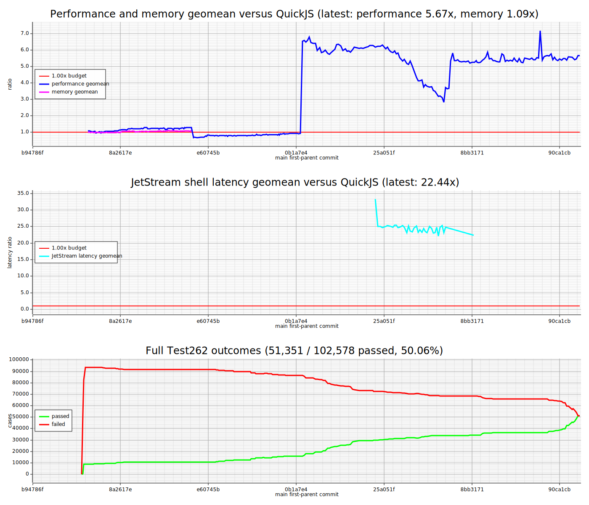

<h1 align="center">Velum</h1>

<p align="center">
  <strong>A from-scratch JavaScript (ECMAScript) bytecode engine in Rust.</strong><br>
  Not a fork. Not a wrapper. Not a binding.
</p>

<p align="center">
  <a href="reports/test-runs/rsqjs-test-report-20260715T084223Z.md"></a>
  <a href="Cargo.toml"></a>
  <a href="LICENSE"></a>
</p>

<p align="center">
  The entire stack—from source text to bytecode, execution, built-ins, modules,
  jobs, and garbage collection—was independently implemented for embedding in
  Rust applications.
</p>

<p align="center">
  <strong><a href="https://github.com/tc39/test262">Test262 conformance corpus</a>:
  53,404 test files · 102,578 required execution variants · 0 failed · 0 skipped</strong>
</p>

<p align="center">
  <a href="#quick-start">Quick start</a> ·
  <a href="#why-velum">Why Velum</a> ·
  <a href="#interesting-internals">Internals</a> ·
  <a href="#roadmap">Roadmap</a>
</p>

## Built with Codex

| Metric | July 15, 2026 snapshot |
| --- | ---: |
| ⏱️ Development time | **10.5 days** (July 5–15, 2026) |
| 🧱 Commits on `main` | **922** |
| 🔀 Merged pull requests | **636** |
| 🦀 Project-authored Rust | **214,451 lines** |
| ✅ Pinned Test262 result | **102,578 / 102,578 variants** |

**One developer. Two to four agents. Ten and a half days. A new JavaScript
engine.**

- 👤 **One developer** owned the architecture, direction, review, and
  integration.
- 🎙️ **Voice-first with Codex Mobile:** most instructions were dictated through
  the microphone.
- 🖥️ **An always-on remote server** kept persistent development agents
  available continuously.
- 🤖 **Two to four Codex agents** worked in parallel almost around the clock.

<details>
<summary><strong>How was it built so quickly?</strong></summary>

The foundation—the first 1,306 lines of project-authored Rust—was created with
GPT-5.5. Development then moved to GPT-5.6 SOL in extra-high reasoning mode,
with one developer continuously directing, reviewing, and integrating the work
of multiple agents.

Velum demonstrates a new scale of individual software development: one
person can now coordinate several capable engineering agents and produce a
large, tested systems project in days rather than months. This was not a short
demo or a generated wrapper; the result is an independent language engine with
a compiler, bytecode VM, standard library, embedding API, and a reproducible
conformance gate.

The numbers come from Git history and GitHub as of the stated snapshot. The
Rust line count includes the engine, runner, and tests, and excludes 43,473
lines in the vendored `RegExp` crate.

</details>

## Current status

<picture>
  <source media="(prefers-color-scheme: dark)" srcset="reports/benchmark-summary-dark.svg">
  <source media="(prefers-color-scheme: light)" srcset="reports/benchmark-summary-light.svg">
  
</picture>

The project initially used `QuickJS` as a behavioral and performance comparison;
that historical baseline remains visible in the benchmark graph while the
engine itself follows its own Rust architecture.

## Why Velum

[Velum](https://www.merriam-webster.com/dictionary/velum) (pronounced
**VEE-lum**) comes from the Latin *vēlum*: sail, canopy, veil, covering. The
name carries two complementary ideas. A sail is a lightweight structure that
draws power from its environment, just as the engine receives capabilities
from its embedder. A membrane is a deliberate boundary, reflecting the
controlled interface between Rust and JavaScript.

- **Broad ECMAScript conformance.** The complete pinned Test262 profile is a
  required, exact-tree correctness check rather than an aspirational feature
  list.
- **An embedding-first API.** Applications can create many isolated VMs,
  compile scripts once, register typed Rust functions, retain VM-owned values,
  load module graphs, run jobs explicitly, and inspect teardown.
- **A safe Rust engine boundary.** The root engine crate has
  `unsafe_code = "deny"` and strict no-panic lints.
- **Explicit ownership and limits.** Each VM owns its heap, globals, realms,
  modules, job queue, roots, resource counters, and deterministic teardown
  report.
- **Inspectable execution.** Embedders can query storage, roots, heap edges,
  reachability, garbage collection, optimization counters, and build identity.
- **Bytecode all the way down.** The AST is a compile-time representation. It
  is discarded before execution and is never used as a hidden runtime
  interpreter.

## ECMAScript coverage

The passing corpus exercises the language and built-in surface across normal,
strict, module, and raw variants. Major areas include:

- functions, closures, classes, private fields, decorators, and `eval`;
- iterators, generators, async functions, async generators, promises, and jobs;
- source-text modules, dynamic import, import attributes, module namespaces,
  and `import.meta`;
- arrays, typed arrays, `ArrayBuffer`, `SharedArrayBuffer`, `DataView`, and
  atomics;
- `Map`, `Set`, weak collections, `WeakRef`, and `FinalizationRegistry`;
- `Proxy`, `Reflect`, realms, and `ShadowRealm`;
- `BigInt`, symbols, modern `RegExp` semantics, and exact UTF-16 strings;
- explicit resource management with disposable and async-disposable stacks;
- `Temporal` and the ECMA-402 `Intl` families included by the pinned corpus;
- Annex B and the staged proposal tests present in the pinned snapshot.

The reproducible profile uses Test262 commit
[`64ff467c0c1d60c077995bb7c5f93a9d8cc8ade1`](https://github.com/tc39/test262/commit/64ff467c0c1d60c077995bb7c5f93a9d8cc8ade1),
plus two tracked corpus corrections documented in
[`tests/corpora/test262/README.md`](tests/corpora/test262/README.md). See the
latest [full correctness report](reports/test-runs/rsqjs-test-report-20260715T084223Z.md)
and the machine-readable
[`full-pass-baseline.txt`](tests/corpora/test262/full-pass-baseline.txt) for the
exact evidence.

## What this engine is not

Velum implements ECMAScript, not a browser or server runtime.

- There is no DOM, HTML, CSS, rendering, `fetch`, browser event loop, or other
  Web Platform API.
- There are no Node.js modules, filesystem APIs, process APIs, package loader,
  or Node.js event loop.
- Host capabilities are supplied deliberately by the embedding application
  through the Rust API.
- The engine is currently a bytecode interpreter with guarded fast paths, not
  a machine-code JIT.

This separation is intentional. The engine provides language semantics; the
embedder decides which clocks, I/O, networking, storage, and scheduling
capabilities a VM receives.

## Quick start

Evaluate source directly:

```sh
cargo run --release --bin rsqjs -- -e '
const values = [1, 2, 3, 4];
const total = values.map(value => value * value).reduce((a, b) => a + b, 0);
print("sum of squares", total);
total
'
```

Or run a script file:

```sh
cargo run --release --bin rsqjs -- script.js
```

The smoke CLI prints lines produced by `print(...)`, followed by the final
value when it is not `undefined`.

## Library embedding

The Rust API separates reusable engine configuration from isolated VM state:

```rust
use rs_quickjs::Engine;

fn main() -> rs_quickjs::Result<()> {
    let engine = Engine::new();
    let mut vm = engine.create_vm();

    vm.register_host_function_typed("cameraLabel", |call| {
        let name: &str = call.argument(0, "name")?;
        Ok(format!("camera:{name}"))
    })?;

    let script = vm.compile_named(
        "camera-session.js",
        r#"
            const camera = cameraLabel("front");
            print(camera);
            camera;
        "#,
    )?;

    let value = vm.eval_compiled_retained(&script)?;
    let owned_value = vm.retained_to_owned(&value)?;
    value.release()?;

    let output = vm.take_output();
    let report = vm.finish()?;

    println!("value: {owned_value:?}");
    println!("output: {output:?}");
    println!("runtime steps: {}", report.resources.runtime_steps);
    Ok(())
}
```

The public surface also includes module compilation and embedder-controlled
loading, multiple realms, explicit Promise job draining and cancellation,
portable `OwnedValue`s, VM-bound `RetainedValue`s, configurable runtime and
storage limits, and heap/optimization snapshots.

## Interesting internals

The execution pipeline has a hard architectural boundary:

```text
source
  -> lexer
  -> parser AST
  -> binding and scope analysis
  -> compiler
  -> AST-free bytecode and function metadata
  -> VM execution
```

The parser AST exists only long enough to perform static analysis and compile
the program. Runtime and bytecode modules cannot import parser or compiler
types. Closures, structured control flow, generators, `await`, modules, and
dynamic evaluation all execute through bytecode-owned state. There is no AST
fallback when an optimization guard misses.

Other notable internals:

- ECMAScript strings are stored as authoritative UTF-16 code units, including
  lone surrogates. UTF-8 is a lazy diagnostic rendering, not the semantic
  representation.
- Static bindings compile to checked slots; property names use interned atoms;
  objects use shapes; and arrays have guarded dense storage paths.
- Numeric and string quickening, native-call caches, call-value caches, direct
  binding operands, linear bytecode plans, and packed-array reductions share
  generic semantic slow paths.
- `OptimizationMode::Disabled` runs the same bytecode without optional fast
  paths. It provides an unusually useful same-engine differential oracle for
  testing optimizer correctness.
- The VM uses explicit roots and a safe mark/sweep collector with weak-key and
  ephemeron handling. Heap reachability can be inspected without mutating the
  VM.
- Suspended async functions and generators park typed bytecode continuation
  state. Promise reactions resume that state through a VM-owned job queue; no
  second async interpreter exists.
- Resource accounting covers runtime steps and every variable-size VM storage
  owner. Teardown reports expose what a VM releases when it is consumed.

The deeper contracts are documented in
[`docs/architecture.md`](docs/architecture.md).

## Safety boundary

The engine crate denies `unsafe` at the Rust compiler level. Project code also
denies panic-oriented APIs such as `unwrap`, `expect`, `panic!`, unchecked
indexing patterns, and dangerous numeric casts through a combination of strict
project rules and rustc/Clippy configuration.

`RegExp` is the current exception to the broader all-source story. The engine
vendors the Rust `regress` implementation as a separate local crate and enables
its checked `prohibit-unsafe` execution paths. The preserved upstream source
still contains feature-dependent `unsafe` implementations, so the repository
does not claim that every vendored source line is `unsafe`-free. A native
A native Velum `RegExp` compiler and executor is planned to remove this
exception and bring regular expressions under the same engine-owned safety
rules.

## Testing and reproducibility

Correctness is built around exact inputs and exact source trees:

- the full pinned Test262 profile, including file- and variant-level totals;
- focused engine fixtures and direct embedding API tests;
- parser, compiler, runtime, module, async, GC, and resource-limit tests;
- same-engine checks with optional optimizations disabled;
- exact-tree CI artifacts, canonical YAML summaries, and derived Markdown
  reports;
- prepared project benchmarks and a separate `JetStream` shell lane.

The repository records the engine commit, runner commit, tested tree, workflow
run, corpus provenance, pass baseline, and benchmark methodology. A green
number can therefore be traced back to the exact code and exact corpus that
produced it.

## Roadmap

The project now moves through three broad stages.

### 1. Conformance — complete for the pinned profile

Maintain zero regressions across the current Test262 snapshot, follow new
upstream language and ECMA-402 tests, and keep corpus changes explicit and
reproducible.

### 2. Fuzzing and differential confidence

Test262 proves a large set of known behaviors. Fuzzing is intended to explore
the combinations nobody wrote down. The planned campaign follows techniques
used around mature engines and scalable systems such as
[V8](https://v8.dev/docs/feature-launch-process),
[SpiderMonkey](https://searchfox.org/mozilla-central/source/js/src/fuzz-tests/README),
[JavaScriptCore](https://github.com/WebKit/WebKit/blob/main/Source/JavaScriptCore/jsc.cpp),
and [ClusterFuzz/OSS-Fuzz](https://google.github.io/clusterfuzz/):

- coverage-guided fuzzers for the lexer, parser, compiler, VM, `RegExp`, module
  loader, value-transfer boundaries, and public embedding API;
- grammar- and structure-aware JavaScript generation so mutations continue to
  reach deep language semantics;
- differential execution against V8, `SpiderMonkey`, and `JavaScriptCore` on a
  normalized, deterministic, host-independent subset;
- differential execution between enabled and disabled optimization modes;
- metamorphic tests which apply semantics-preserving source transformations and
  require the same completion, value, output, and error behavior;
- stress schedules for GC, weak references, realms, module graphs, promises,
  async continuations, resource limits, timeouts, and out-of-memory paths;
- automatic crash deduplication, testcase minimization, deterministic
  reproducers, regression promotion, and continuous distributed execution.

Cross-engine comparisons will normalize errors and outputs and exclude
uncontrolled time, randomness, locale, and host behavior. A difference is a
lead to investigate, not automatically proof that one engine is wrong.

### 3. Performance

Once conformance and continuous fuzzing provide a strong correctness envelope,
the primary focus shifts to speed and memory: bytecode dispatch, allocation and
GC, shapes and inline caches, dense arrays and typed arrays, call paths,
quickening, module startup, async scheduling, and compile-time cost.

Optimization work will remain benchmark-driven and will preserve the disabled
optimization mode as a semantic oracle. The goal is not a single synthetic
score; it is predictable performance for real embedded workloads without
weakening isolation, accounting, or safe Rust boundaries.

## Maturity

This is an early engine release, not an MVP interpreter. It has broad standards
coverage and substantial runtime machinery, but its public Rust API is still
evolving, async Rust host callbacks are not yet complete, performance varies
by workload, and the engine has not yet accumulated the years of fuzzing and
production exposure of established runtimes.

Use it today for experimentation, conformance work, engine research, and
controlled embedding. Evaluate the current API, resource model, and performance
against the needs of a production deployment before adopting it as a security
boundary.

## License

The engine is
[MIT-licensed](https://github.com/surveria/velum/blob/main/LICENSE). The
vendored `RegExp` crate retains its upstream MIT OR Apache-2.0 licensing and
provenance files.
